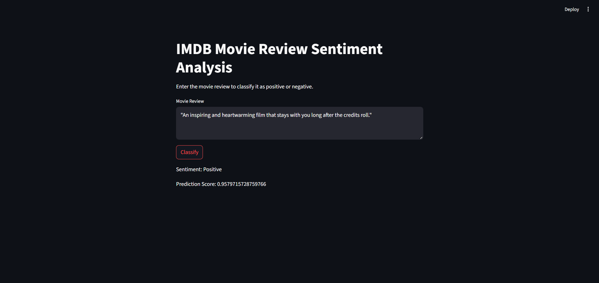

# 🎬 IMDb Sentiment Analysis with Simple RNN

This project demonstrates how to use a **Simple Recurrent Neural Network (RNN)** to solve a classic **Natural Language Processing (NLP)** problem: **binary sentiment classification** on movie reviews from the [IMDb dataset](https://ai.stanford.edu/~amaas/data/sentiment/). The goal is to predict whether a given movie review expresses a **positive** or **negative** sentiment.

---

## 🧠 Why Sentiment Analysis?

Sentiment analysis allows machines to interpret human emotions behind text — crucial for tasks like product review classification, customer feedback analysis, and social media monitoring. Movie reviews are ideal for sentiment analysis since they often express strong, opinionated language, making it a good testbed for NLP models.

---

## 🔁 Why Use a Simple RNN?

Text is sequential — the meaning of a word often depends on previous words. Unlike traditional machine learning models, **RNNs** are capable of processing sequential data by maintaining a "memory" of previous inputs through hidden states.

In this project:
- We use a **Simple RNN**, which is the most basic type of recurrent network.
- Though it struggles with long-term dependencies, it's excellent for learning short-to-medium-range patterns and provides a solid foundation for understanding more advanced models like LSTMs or GRUs.
---
## 🚀 Live Demo
   👉 https://simplernnmohit.streamlit.app/
---

## 🖼️ Screenshots
### 📌 Sentiment Prediction Output

> Displays how the model predicts sentiment for a custom movie review.

---

## ⚙️ Project Workflow (Theoretical)

1. **Data Preparation**
   - Load and preprocess the IMDb dataset.
   - Tokenize the reviews to convert words into integers.
   - Pad sequences to ensure consistent input length.

2. **Model Architecture**
   - **Embedding Layer**: Transforms each word index into a dense vector of fixed size.
   - **Simple RNN Layer**: Processes sequences word by word, capturing dependencies in time.
   - **Dense Layer with Sigmoid Activation**: Outputs a value between 0 and 1 representing sentiment probability.

3. **Training**
   - Use **binary cross-entropy** as the loss function, optimized with **Adam**.
   - Evaluate performance using accuracy on training and validation data.

4. **Inference**
   - Given a new review, the model predicts the sentiment (Positive if score > 0.5, otherwise Negative).

---

## 📊 What You Learn

- Core NLP preprocessing steps: tokenization, padding, vocabulary size management.
- How RNNs process text sequentially.
- Why RNNs are foundational for text and sequence modeling.
- How prediction thresholds turn probabilities into human-readable classes.

--- 
## ⚠️ Limitations

- Simple RNNs may **forget long-term dependencies** due to vanishing gradients.
- Performance may degrade on long or complex reviews.
- Future improvements could include using **LSTM**, **GRU**, or **Transformer-based** models for better accuracy and context understanding.

---

## 🧩 Summary

This project offers a hands-on and conceptual introduction to using deep learning for text classification. It builds intuition on how sequence models understand language, paving the way for more advanced applications in NLP.
